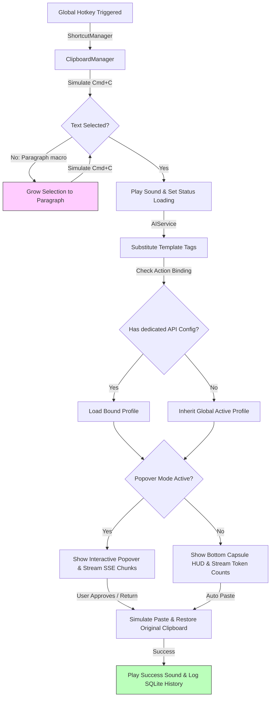

# 🔮 Smart Text Key

[](https://developer.apple.com/macos/)
[](https://swift.org)
[]()
[]()

**Smart Text Key** is a premium, ultra-fast, background-only macOS utility that brings local and cloud LLM intelligence directly into any text editing area on your system. By pressing customizable global hotkeys, it captures the selected text, streams it through an AI engine (like Ollama, OpenAI, DeepSeek, or Anthropic), pastes the optimized results instantly, and cleanly restores your clipboard.

Designed for developers, writers, and power users who want friction-free AI integrations without heavy dependencies, context switches, or recurring authorization prompts.

---

## ✨ Features

- **🚀 Direct In-Place Transformation**: Select any text in any macOS application (Xcode, Slack, VS Code, Browser), press your custom hotkey, and watch it transform in-place.
- **⚡ Dynamic SSE Token Streaming**: Character-by-character real-time streaming inside an elegant interactive popover with live token counting.
- **🎨 Accent Customization & HUD Themes**: Re-color selection rings, progress HUDs, and popover buttons using vibrant HSL-tailored colors (Blue, Emerald, Amber, Graphite, and Purple). Segmented support for System/Light/Dark OSD styles.
- **📂 SQLite-Backed History**: Local SQLite database storing your complete input/output transformation history. Fully searchable in real time with quick-copy, delete, and purge controls.
- **🔒 ssh-Grade Keychain Security**: Saves sensitive API credentials inside Apple’s native Keychain Services with automatic background UserDefaults migration.
- **🛠️ Automated API Failovers**: Attach secondary backup profiles to any API profile. If your primary Ollama or OpenAI server goes offline, the request automatically redirects to your fallback route.
- **🔊 Premium Sound Feedback**: Native sound cues utilizing macOS AppKit `NSSound` alerts. Plays `"Purr"` on capture, `"Glass"` on completion, and `"Basso"` on failovers or errors.
- **🔍 Smart Selection Growth**: If you press a hotkey with an empty selection, a built-in macro automatically grows the text cursor to capture the active paragraph before running.
- **🧬 Auto-Discovery Combobox Picker**: A custom editable dropdown list that queries standard `/v1/models` and native Ollama `/api/tags` endpoints in the background, updating suggestions as you type.

---

## 🛠️ Architecture



---

## 💻 Tech Stack & Design

1. **Platform Target**: Native macOS 14.0+ (compiled natively for Apple Silicon and Intel targets).
2. **Frameworks**: 100% native Swift/SwiftUI, AppKit integrations for window and menu controls, and Carbon APIs for keyboard event simulation.
3. **Strict Concurrency**: Fully compliant with **Swift 6 strict concurrency checks** (100% warning-free).
4. **Zero-Dependency Core**: Standard SQLite3 libraries and native Security APIs are wrapped directly, keeping dependencies lightweight (relying only on `KeyboardShortcuts` for global hotkey registering).
5. **Aesthetics**: Glassmorphism (`NSVisualEffectView`), smooth micro-animations, and dynamic visual rings aligned with Apple's human interface guidelines.

---

## 🚀 Getting Started

### Prerequisites

- macOS 14.0 or newer.
- Xcode 15.0+ or Swift Toolchain 6.0+.

### Building & Compilation

Clone the repository and build using the Swift Package Manager:

```bash
git clone https://github.com/your-username/smart-text-key.git
cd smart-text-key
swift build -c release
```

The compiled binary will be available under `.build/release/SmartTextKey`.

### Running Unit Tests

The test suite validates database history persistence, Keychain cryptographic storage, and model operations without touching user production files (isolating database tests using `:memory:` bounds):

```bash
swift test
```

---

## 📖 How to Use

### 1. Initial Launch
Upon initial launch, the application registers as an **accessory utility** (running purely in the background without a Dock icon) and opens the **Settings Panel** automatically. A `"character.bubble"` icon will appear in your macOS status bar.

### 2. Configure API Settings
In the **API Settings** tab:
- Add a profile (e.g., Local Ollama, OpenAI, or DeepSeek).
- Enter your **API Base URL** and **API Key** (use the eye toggle to reveal/hide).
- Focus on the **Model Name** to dynamically query active models directly from your server!
- Configure an optional **Fallback API Profile** for failover backup support.

### 3. Create & Bind Actions
In the **AI Actions** list:
- Click **"Add Action"** to create a custom template.
- Specify your **System Prompt** (e.g., "You are an expert translator...") and **User Template** (must include `{{TEXT}}` placeholder, and can contain `{{CLIPBOARD}}`, `{{DATE}}`, or `{{CURRENT_APP}}` tags).
- Bind a dedicated **API Profile** or let it inherit the global active one.
- Record a global hotkey shortcut by clicking the key recorder.

### 4. Interactive HUD Popover
If **"Show Preview Popover"** is enabled, pressing the hotkey pops up an elegant popover showing the AI response streaming in real time. Use keycaps or click buttons to:
- `↩ Enter` (or Paste): Pastes the result directly into your active cursor.
- `⌘C` (or Copy): Copies the text to the clipboard.
- `⌘R` (or Regenerate): Clears and restarts the AI generation loop.
- `⎋ Esc` (or Discard): Safely cancels the active thread and restores your original clipboard.

---

## 🔒 Security & Privacy

Smart Text Key values your security and privacy above all:
- **Zero Cloud Leakage**: Local profiles (e.g. Ollama) communicate directly with your localhost port (`11434`) and send nothing to third-party endpoints.
- **SSH-Grade Lockdowns**: Secure Keychain keys are locked with owner-only access. In-app plist files store only empty tokens.
- **Clipboard Preservation**: Captured select bounds and original clipboard contents are held in-memory and cleanly restored immediately after pastes, ensuring no data loss.

---

## 📄 License

This project is licensed under the MIT License - see the [LICENSE](LICENSE) file for details.
